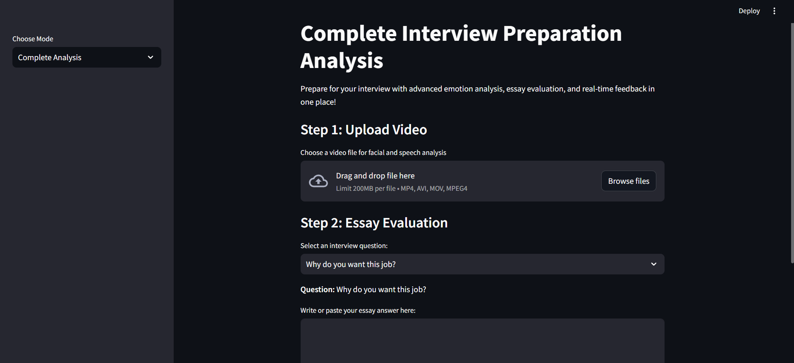
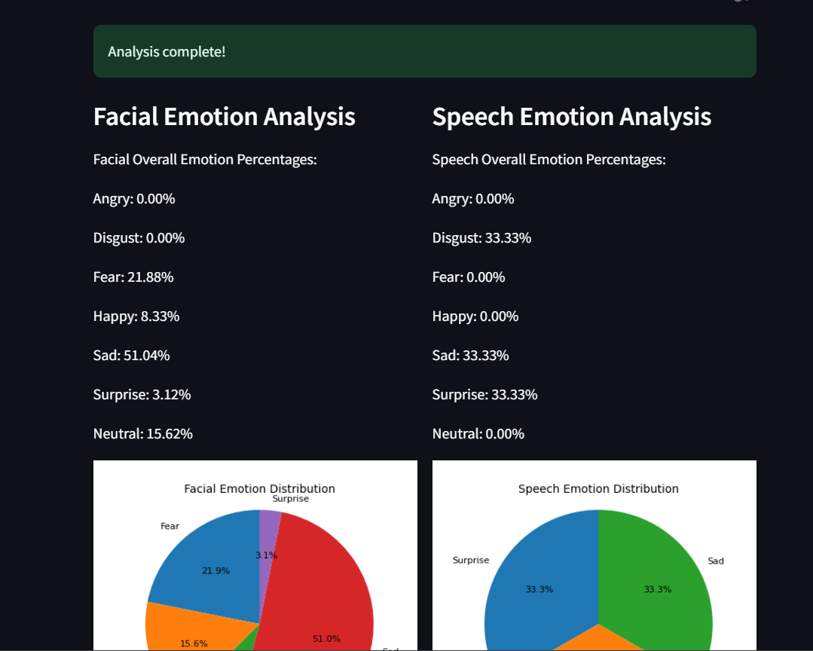
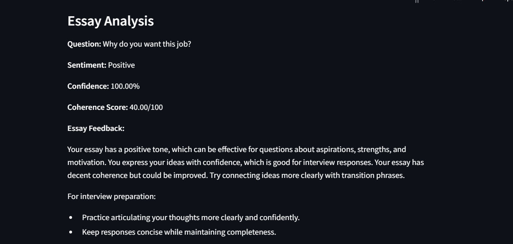
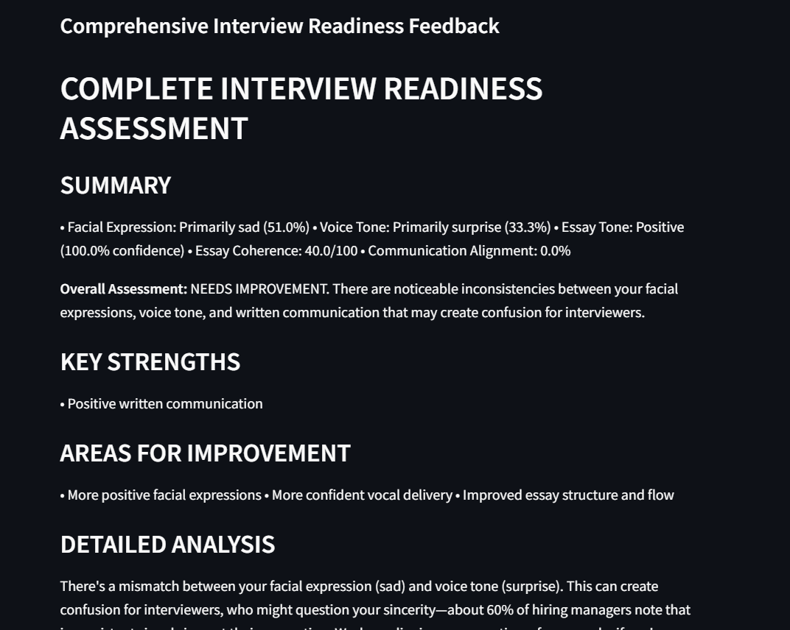

# Automatic assessment of verbal and non-verbal communication skills using deep learning

### This Project takes a video as an input and gives feedback on the video sentiment and audio sentiment from the extracted audio.
### Has a streamlit UI from which the user can input the video.

### Once the video is uploaded and the essay is also given, the analysis can be done and the user can visualize the output accordingly.

### A comprehensive report can be downloaded at the end so that the user can get a better understanding and has the report with them. 
[View the Final Report](reports/interview_complete_report.pdf)
